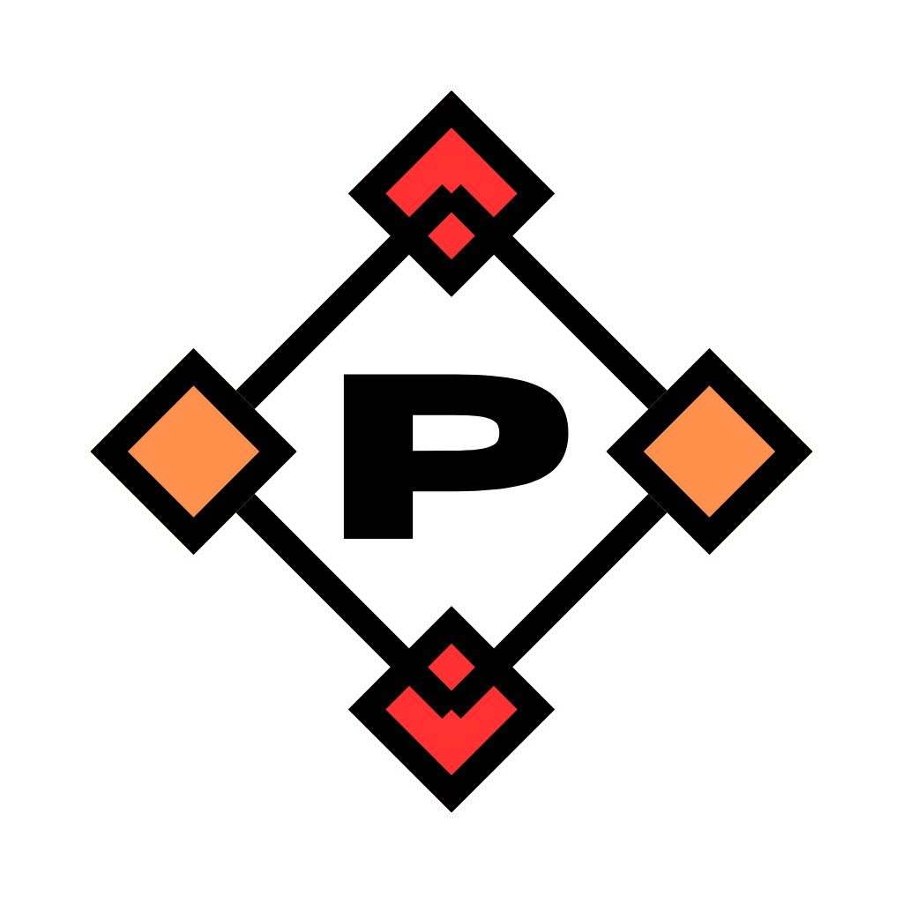

# Palket: the Pal-to-Pal market 

## Project Overview 
Palket aims to simplify peer-to-peer trading of goods by providing:

- **Secure escrow:** Funds are held by the smart contract until the offer is finalized.
- **Lottery:** If a finalized trade does not occur within a specified period, offers may be forfeited, sending 80% of the funds to a random wallet from the wallets that have interacted with the contract.
- **Incentives for fair conduct:**
  - Both the receiver and the sender must provide a deposit of 50% of the product value to ensure fairness from both parties.
  - When the receiver finalizes a trade, he/she also provides a score for the sender, which is stored in the smart contract. The average score as sender for any address can be retrived from the smart contract.
  - If the receiver does not receive the expected product, he/she may decide to not finalize the offer and wait for the offer's forfeiture.

This repository contains the frontend code that interacts with the on-chain smart contract and the XMTP messaging protocol. Through this frontend, users can:

- Browse and filter offers.
- Create, accept, finalize, cancel, or forfeit offers.
- Configure personal sender descriptions.
- Engage in private, encrypted communication with other users.

To learn more about the Palket smart contract, please check the project's wiki.

## Architecture
Palket consists of three major components:

- **Smart Contract (on Ethereum):**
  Stores all offers, user profiles, and handles the logic for escrow and states of each trade.

- **Frontend (React.js):**
  This repository hosts the React-based user interface that allows users to connect their wallet, interact with the contract, and use the XMTP chat. It retrieves offer details from the contract, and guides users through offer creation and acceptance flows.

- **XMTP Integration:**
  For private messaging, Palket integrates XMTP, a decentralized, end-to-end encrypted messaging protocol. This enables users to safely negotiate details or ask questions without leaving the platform.

## Deployment Status: ***DEVELOPMENT***

Currently the Palket smart contract is deployed in Sepolia testnet to test it before deploying it to Ethereum main network.

## Usage 
This code is meant as a tool o interact with the smart contract, which contains the relevant information about the offers and user information. Therefore, you can deploy (and even modify) the frontend app code in your own computer, or just use the code deployment in Github Pages website.

### Using the Github Pages deployment
You will need the MetaMask browser extension installed and configured.

**Link:** https://palket.github.io/app/

### Deploying your own code
#### Prerequisites
Before running or modifying the frontend, ensure you have the following:

- **Node.js & npm:**
  Node.js (v14.x or newer) and npm must be installed.
  You can verify with:
```
node -v
npm -v
```
- **MetaMask:**
  Have the MetaMask browser extension installed and configured. You will need to connect your wallet to the appropriate Ethereum network (such as Sepolia test network for development or Ethereum mainnet for production).

- **Smart Contracts Deployed:**
  Ensure the Palket and USDC mock contracts are deployed and that the contract addresses and ABIs are placed in `./src/PalketInfo.json`.

#### Environment Setup
Clone this repository:
```
git clone https://github.com/palket/palket-frontend.git
cd palket-frontend
```
Install dependencies:
```
npm install
```

Contract ABI and Address Configuration: Ensure the `PalketInfo.json` is properly placed in `./src`. It shall contain the following fields: "palketaddress", "usdcaddress", "usdcabi" and "palketabi".

#### Running the Application
Start the Development Server:
```
npm run dev
```
This command starts the React development server on http://localhost:5173 (or a similar port).
Open the URL in your browser and connect your MetaMask wallet when prompted.

## Interacting with the Palket App
**1. Connect Your Wallet:**
- Open the application in your browser, and click "Connect Wallet" to connect MetaMask.
- The UI will reflect your account address and USDC balance upon successful connection.

**2. Create an Offer:**
- Choose whether you are creating the offer as a Receiver or Sender.
- Input the product description and the product value (in USDC).
- Depending on offer type, the required deposit and approvals will be handled automatically.
- After successful creation, the offer will appear in the "All Offers" list.

**3. Accept, Cancel, and Finalize Offers:**
- **Accept**: The counterparty pays the required amount (deposit or total) and moves the offer into the "Accepted" state.
- **Cancel**: Offers still in the "Created" state can be canceled by the initiating party.
- **Finalize**: Once goods are exchanged offline, the receiver finalizes the offer on-chain and assigns a score to the sender.
- **Forfeit**: If an accepted offer remains unfinalized for more than 180 days, it can be forfeited by the receiver, freeing up locked funds.
**4. User Profiles and Scores:**
- Each sender accumulates scores from finalized trades.
- Set your description to let other users know more about you (visible under your address profile).

## Palket integrates XMTP for secure, decentralized messaging:
- **Start a conversation**: Navigate to a user's profile page to open a secure chat.
- **Encrypted messaging**: XMTP ensures messages are end-to-end encrypted.
- **No central servers**: Messages persist on a decentralized network rather than a centralized server.

*Note: XMTP integration is currently a work in progress. Some initialization errors or limitations may occur.*

## Troubleshooting
- **Not Connected**: If the app shows "Not connected", ensure MetaMask is unlocked and on the correct network.
- **Contract not found**: Verify deployed contract addresses and ABIs are correct.
- **XMTP initialization error**: Currently normal since the XMTP implementation is still work in progress...

## License
GNU General Public License (GPL) v3.0:
This license allows the use, modification, and redistribution, even commercially, of the code. However, any derivative work must also be licensed under GPL (copyleft) and users must make the source code available for derivatives. This way, we ensure the project to remain open source.
For more details, see the [LICENSE](LICENSE) file.
